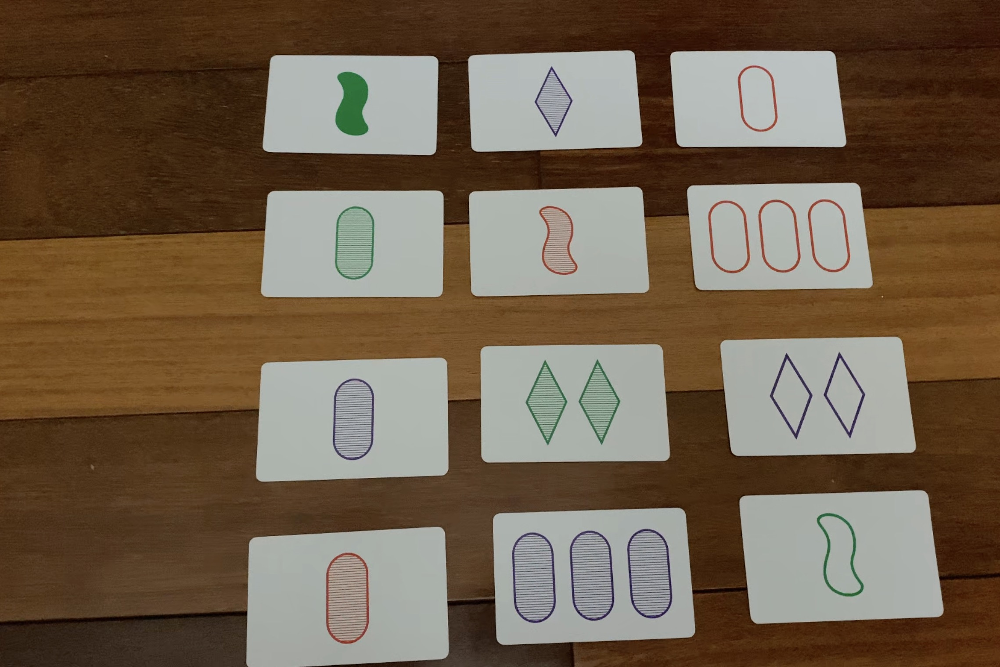

# Set card game solver (setcgs)
A computer vision web application that solves the card game [Set](https://en.wikipedia.org/wiki/Set_(card_game)). The sets are identified from an uploaded image. 

## Usage
1. Go to https://charleskolozsvary.github.io/setcgs
2. Upload an image (with cards from Set).
   - For best results, ensure the photo is well-lit, the background is relatively uniform, and there is minimal glare. But these conditions are forunately not *too* strict---image quality is generally more important, but any modern phone camera provides plenty of resolution.[^1]
3. Click "Identify sets", wait 15 seconds or so, then view the labelled cards and sets!
   - If the cards were labelled correctly and no sets are highlighted, there were none.
  
## Demo Screencast

## Walked through example[^2]
Here's an image with some sets:

### Identifying features
Every card in *Set* has four features, each of which have three varieties. 

| color   |  shape     | number | filling |
| ------- | ---------- | ------ | ------- |
| purple  |  squiggle  |   1    |  empty   | 
| red     |   rhombus  |   2    |  dashed  | 
| green   |   oval     |   3    |  full    |

The card features as identified by the program are pictured below. Each feature is abbreviated by its first or first two letters ('P' is for 'purple', 'OV' is for 'oval', 'E' is for empty, and so on). You can check for yourself that they are correct.

### Sets
There end up being 5 sets among those cards. Here they are highlighted (as outputted by the program):

[^1]: I'm relatively happy with this program's success rate. It correctly identifies cards most of the time, but there's definitely room for improvement. If the image resolution is low, lighting is poor, cards are touching or obscurred, the background is unusual, or glare is prevalent, the cards may not be identified correctly (and so neither will the sets).

[^2]: You can also view the printed-page output for this example at [examples/exampleoutput.pdf](examples/exampleoutput.pdf).
